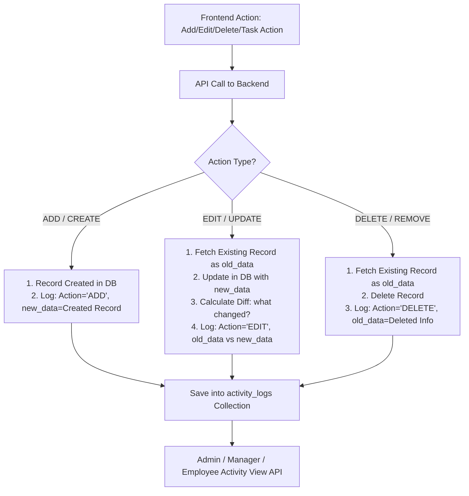

# 📋 System Activity / Audit Logs Module - Architecture & Implementation Flow

આ ડોક્યુમેન્ટમાં **CNC Dashboard** માટે **System Activity Logs (Audit Logs)** મોડ્યુલનું વિગતવાર આર્કિટેક્ચર, ડેટાબેઝ ડિઝાઇન, રોલ-બેઝ્ડ એક્સેસ કંટ્રોલ (RBAC) અને બંને બેકએન્ડ (**Laravel** & **Node.js**) માટેનું ફ્લો સમજાવવામાં આવ્યું છે.

---

## 🎯 ૧. મોડ્યુલનો મુખ્ય ઉદ્દેશ (Core Objectives)

1. **Activity Tracking**:
   - સિસ્ટમમાં થતી મુખ્ય એક્શન્સ: **`ADD` (Create)**, **`EDIT` (Update)**, **`DELETE` (Remove)** ટ્રેક કરવી.
   - ખાસ કરીને **Employee Dashboard / Task Management** માં થતા ફેરફારો:
     - ટાસ્ક સ્ટેટસ બદલાવું (`In Progress` $\rightarrow$ `Done`)
     - સ્પેન્ટ ટાઈમ / ટાઈમશીટ અપડેટ થવી
     - એસાઈની અથવા પ્રાયોરિટી બદલાવી
2. **Change Diff Capture (પહેલા શું હતું અને બદલીને શું કર્યું)**:
   - **`old_data` (Before)** અને **`new_data` (After)** નો ફેરફાર સ્ટોર કરવો જેથી સ્પષ્ટ દેખાય કે યુઝરે કઈ ફીલ્ડમાં શું ફેરફાર કર્યો.
3. **Role-Based Visibility (કોણ શું જોઈ શકે)**:
   - **Admin / Project Manager**: તમામ યુઝર્સ અને આખી સિસ્ટમના બધા જ Activity Logs જોઈ શકશે.
   - **Employee**: ફક્ત પોતાના આઈડી (`user_id`) દ્વારા થયેલા પોતાના જ Logs જોઈ શકશે.

---

## 🗄️ ૨. MongoDB Schema Design (`activity_logs` Collection)

આ કલેક્શન બંને બેકએન્ડ (**Laravel MongoDB / Node.js Mongoose**) માં એકસમાન રહેશે:

```json
{
  "_id": "ObjectId",
  "user_id": "682710278ba4309b30025994",       // જેણે એક્શન લીધી તે યુઝરનો ID
  "user_name": "Parth Patel",                  // યુઝરનું નામ (Quick View માટે)
  "user_role": "Employee",                     // Admin | Project Manager | Employee
  "module": "Task Management",                 // Tasks | Projects | Employees | Leaves | Timesheet
  "action": "EDIT",                            // ADD | EDIT | DELETE | STATUS_CHANGE
  "record_id": "682710278ba4309b30025995",     // જે રેકોર્ડ પર એક્શન થઈ તેનો ID (e.g. Task ID)
  "record_title": "CNC-1961: Improve UI",      // રેકોર્ડનું ટાઈટલ / નામ
  "description": "Updated Task Status from 'To Do' to 'In Progress'",
  "old_data": {                                // બદલાવ પહેલાંનો ડેટા (Diff)
    "status": "To Do",
    "spent_hours": "01:30"
  },
  "new_data": {                                // બદલાવ પછીનો નવો ડેટા (Diff)
    "status": "In Progress",
    "spent_hours": "02:00"
  },
  "ip_address": "192.168.1.13",                // યુઝરનો IP
  "user_agent": "Mozilla/5.0 ...",             // બ્રાઉઝર વિગતો
  "created_at": "2026-08-20T13:30:00.000Z"
}
```

---

## 🔐 ૩. રોલ-બેઝ્ડ એક્સેસ કંટ્રોલ (Role-Based Visibility Matrix)

| Role | પરમિશન / કયો ડેટા દેખાશે | Query Filter |
| :--- | :--- | :--- |
| **Admin** | **તમામ ડેટા** (આખી સિસ્ટમમાં કોણે શું કર્યું તે બધું) | `{}` (No filter, with module/user search) |
| **Project Manager** | **પ્રોજેક્ટ ટીમ અને તમામ સંબંધિત Logs** | `{ user_id: { $in: teamMembers } }` અથવા Full Logs |
| **Employee** | **માત્ર પોતાના જ Logs** | `{ user_id: currentUser._id }` |

---

## 🔄 ૪. Activity Logging કેવી રીતે કામ કરશે? (Implementation Workflow)



---

## 🛠️ ૫. બેકએન્ડ ઇમ્પ્લીમેન્ટેશન પ્લાન

### A. Laravel Backend (`c:\xampp\htdocs\cnc-dashboard`)
1. **Model & Migration**:
   - `App\Models\ActivityLog.php` મોડલ બનાવવું.
2. **Helper / Service Class**:
   - `App\Services\ActivityLogService::log($module, $action, $recordId, $recordTitle, $oldData, $newData, $description)`
3. **Controller & Route**:
   - `ActivityLogController.php` $\rightarrow$ `GET /api/activity-logs` (Pagination, Filter by User, Date, Module).
   - રોલ ચેક કરીને એમ્પ્લોયી માટે આપોઆપ `$query->where('user_id', Auth::id())` લાગુ પડશે.
4. **Controllers માં Logging Call કરવી**:
   - `TaskController.php` (Task create/edit/status change/spent time).
   - `UserController.php` (Employee add/edit/delete).
   - `ProjectsController.php` (Project add/edit/delete/assign).

---

### B. Node.js Backend (`d:\CNC-Dashboard-New\cnc-dashboard-be`)
1. **Model**:
   - `src/models/ActivityLog.ts`
2. **Service**:
   - `src/services/activityLog.service.ts` $\rightarrow$ `createActivityLog()`
3. **Module / Controller**:
   - `src/modules/activityLog/activityLog.controller.ts`
   - `src/modules/activityLog/activityLog.routes.ts` $\rightarrow$ `GET /api/activity-logs`
4. **Controllers માં Logging Call કરવી**:
   - `task.controller.ts`, `user.controller.ts`, `project.controller.ts`.

---

## 🖥️ ૬. ફ્રન્ટએન્ડ (UI View) કેવું દેખાશે?

1. **નવું પેજ / ટેબ**: **`Activity Logs`** અથવા **`System History`**
2. **Table Columns**:
   - **Timestamp**: તારીખ અને સમય (e.g. `20-08-2026 06:45 PM`)
   - **User**: નામ અને રોલ (Avatar સાથે)
   - **Module**: `Task Management` / `Employee` / `Projects`
   - **Action**: Badge (`ADD` - લીલો, `EDIT` - બ્લુ, `DELETE` - લાલ)
   - **Description / Summary**: e.g., *"CNC-1961: Status changed from 'Pending' to 'In Progress'"*
   - **View Diff (Modal/Drawer)**: ક્લિક કરવાથી જૂની વેલ્યુ (`old_data`) અને નવી વેલ્યુ (`new_data`) સાઈડ-બાય-સાઈડ દેખાશે.
3. **Filters**:
   - Date Range (Start Date - End Date)
   - Module Dropdown
   - Action Type Dropdown (`ADD`, `EDIT`, `DELETE`)
   - Employee Dropdown (Admin & PM માટે)

---

## 🚀 ૭. નેક્સ્ટ સ્ટેપ્સ (Next Steps)
જ્યારે તમે મંજૂરી આપો ત્યારે આપણે:
1. **Laravel Backend** માં `ActivityLog` મોડલ, સર્વિસ અને API બનાવીશું.
2. **Node.js Backend** માં સમકક્ષ `ActivityLog` મોડલ, સર્વિસ અને API બનાવીશું.
3. ટાસ્ક મેનેજમેન્ટ તથા મુખ્ય મોડ્યુલ્સમાં લોગિંગ શરૂ કરાવીશું.
4. ફ્રન્ટએન્ડ માટે UI સ્ક્રીન ડેવલપ કરીશું.
